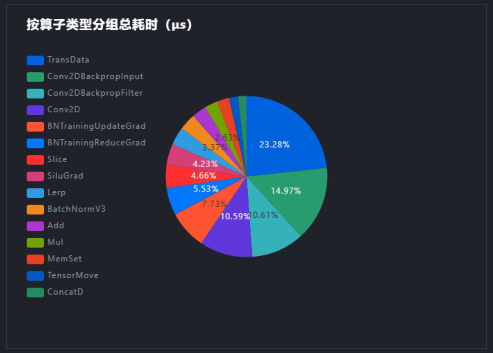
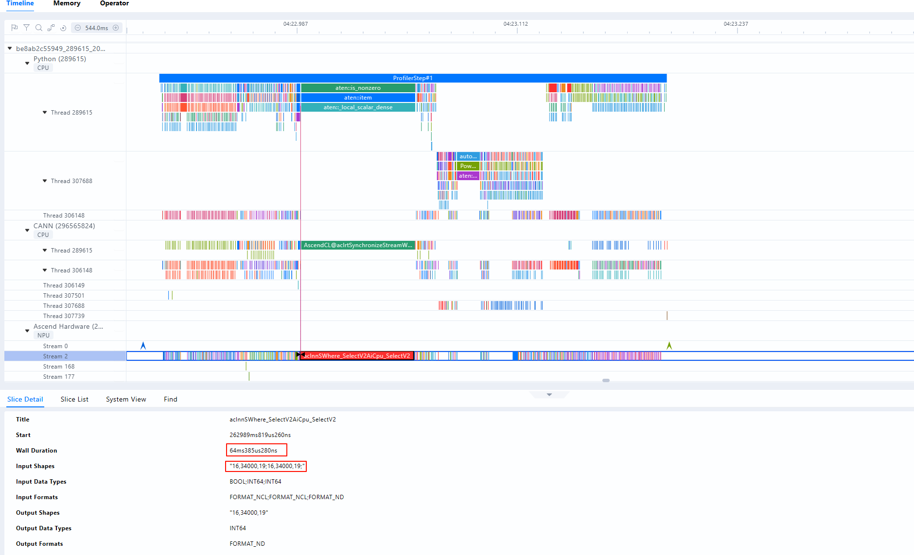
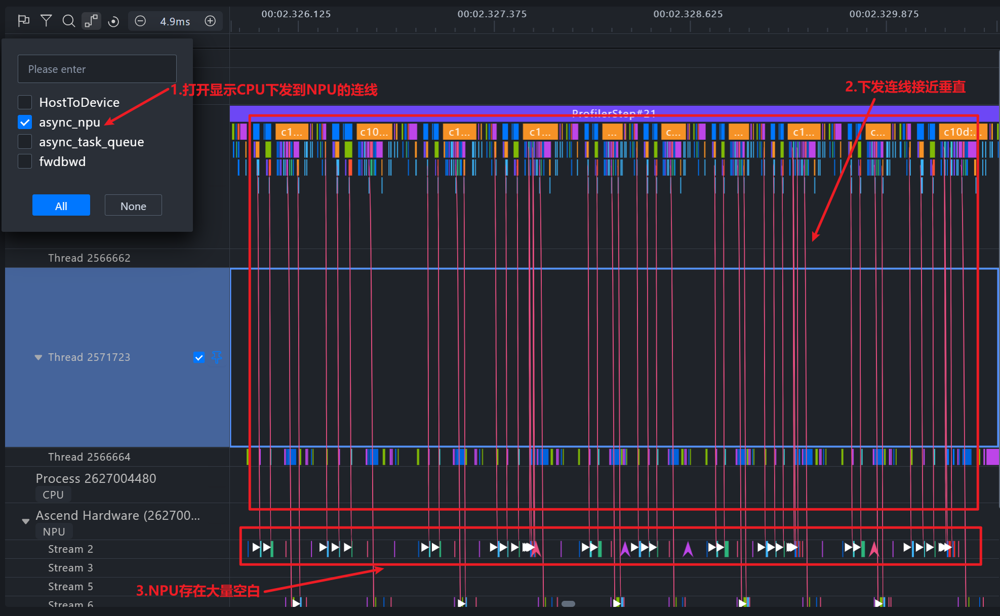

# FSDP2 后端模型性能优化指南

本文面向 MindSpeed LLM FSDP2 分布式训练，阐述性能指标、Profiling 采集、瓶颈定位及优化特性选型方法。本文不适用于在线推理、KV Cache、推理量化和服务化调度；推理性能不能直接套用本文的指标和结论。

## 性能指标与判定参考

### 核心指标

FSDP2 训练优先观察以下指标：

| 指标 | 定义 | 用途 |
| --- | --- | --- |
| 稳态单 step 耗时 | 完成一个 optimizer step 的时间，包含梯度累积对应的所有 micro batch | 判断端到端性能，日志字段为 `elapsed time per iteration (ms)` |
| 有效 token 吞吐 | 所有参与训练的有效 token 数除以 step 耗时 | 日志字段为 `tokens/s` |
| MFU | 模型实测 FLOPS 与硬件理论峰值之比 | 判断计算资源利用率；仅在 FLOPS 估算口径相同的模型间比较 |
| 峰值显存 | `max_memory_allocated` 和 `max_memory_reserved` | 区分真实张量占用与 allocator 预留/碎片 |

### 性能指标观测

以下示例适用于线上或长时间训练过程中的轻量级性能观测，通过训练日志持续查看单 step 耗时、吞吐和 MFU，不生成全量 trace，因此不能拆解算子、通信和 Device Free 时间。

```shell
torchrun ${DISTRIBUTED_ARGS} train_fsdp2.py ${CONFIG_YAML} \
  --training.logging_steps 1 \
  --training.log_throughput true
```

| 参数 | 配值 | 作用 |
| --- | --- | --- |
| `--training.logging_steps` | `1` | 建议每个 optimizer step 打印一次训练日志，日志包含 `elapsed time per iteration (ms)`、loss、grad norm 和峰值显存 |
| `--training.log_throughput` | `true` | 开启吞吐统计，在训练日志中增加 `tokens/s` 和 `mfu` |

## 单步迭代时间计算

更准确的 FSDP2 step 表达是：

```text
step_time = computation_time
          + unhidden_communication_time
          + device_free_time
```

优化器、梯度处理和后处理中的算子计入计算时间，其中的集合通信计入通信时间。请勿将时间线上所有计算事件与所有通信事件直接相加：FSDP 参数 all-gather、梯度 reduce-scatter、EP/CP 通信以及异步 D2H/H2D 拷贝可能与计算重叠，各分类事件的总和可能超过整体 step 的耗时。

### 耗时分析关注项

未掩盖通信时间是在耗时分析阶段观察的指标，表示通信没有与计算重叠的时长。通信事件持续时间很长但完全被计算覆盖时，不计入未掩盖通信时间。

| 关键路径项目 | 参考范围 | 需要关注 | 常见原因 |
| --- | --- | --- | --- |
| 未掩盖通信 | `<= 10%` | `> 20%` | FSDP all-gather/reduce-scatter、EP all-to-all、CP send/recv 无法被计算掩盖 |
| Free 时间 | `< 3%` | `>= 3%` | Host 下发慢、CPU 争用、频繁小算子、同步 API 或线程配置不当 |
| 计算 | 通常是主要部分 | 利用率低且空隙多 | 未使用融合算子、shape 不友好、负载过小、专家不均衡 |

`Free` 表示 Device 既未执行计算也未执行通信的时间段。其占比应小于 3%；若占比偏高，通常表明 NPU 在等待 Host 下发任务，此时可结合 HostToDevice 连线、Runtime API 以及 CPU/PyTorch 轨迹来确认 Host Bound。

### Profiling 中的阶段和事件

不同 CANN、TorchNPU 和 MindStudio Insight 版本的显示名称可能略有差异。定位时应同时看 CPU/PyTorch 轨、NPU Kernel 轨和 HCCL 轨。

| 阶段 | 起止边界 | Profiling 中常见字段或事件 | 说明 |
| --- | --- | --- | --- |
| 前向 | 第一个模型算子发起，到 loss 计算结束 | `Module`/`PyTorch Op`、`aten::*`、Attention、MatMul、RMSNorm、RoPE、CrossEntropy 对应 NPU Kernel | FSDP forward all-gather 可能出现在每层计算之前 |
| 反向 | `loss.backward()` 发起，到最后一个梯度完成 | `autograd::engine::evaluate_function`、`AccumulateGrad`、反向 NPU Kernel | FSDP reduce-scatter 通常与反向逐层重叠 |
| FSDP 通信 | 参数预取到可计算，或梯度归约开始到依赖解除 | `HcclAllGather`、`HcclReduceScatter` 及对应 HCCL task | 只把没有被计算覆盖的尾部或等待计入未掩盖通信 |
| EP 通信 | token dispatch 开始，到本地专家可计算；combine 开始，到 token 恢复 | `HcclAllToAll`/`HcclAllToAllV`、GroupedMatMul、permute/unpermute | 查看不同 rank 的 token 数与结束时间，识别专家负载不均衡 |
| CP 通信 | Attention 的序列/Head 重排或 Ring 交换开始，到下一依赖算子可执行 | `HcclAllToAll`、`HcclSend`、`HcclRecv`、Attention Kernel | Ulysses 常见 all-to-all；Ring 常见 send/recv 与 Attention 流水 |
| 优化器 | 梯度裁剪开始，到参数更新和 `zero_grad` 完成 | `Optimizer.step`、`AdamW.step`、`aten::_foreach_*`、grad norm/all-reduce | swap optimizer 还会出现 H2D/D2H 拷贝和等待事件 |
| 后处理与同步 | 参数更新后，到下一 step 可安全开始 | loss/grad norm `all_reduce`、`barrier`、日志、保存、清理缓存 | checkpoint step 不应进入常规性能统计 |
| Host 下发与 Device Free | CPU 发起框架调用，到 Runtime 下发 NPU task；Device 侧没有计算和通信任务 | `aclrtLaunchKernel`、Runtime API、Task Queue、HostToDevice 连线、`Free` | `Free` 占比大时可认为存在 Host Bound，继续检查 CPU 争用、小算子和同步调用 |

## 性能数据采集

详细参数见[性能数据采集](../tools/profiling.md)。官方工具的采集方式和适用场景请参考《性能问题通用定位指南》中的“[性能工具的使用](https://www.hiascend.com/document/detail/zh/mindstudio/latest/practicalcases/GeneralPerformanceIssue/MindStudio/26.1.0/zh/cases/general_performance_issue_troubleshooting_guide/performance_tool_usage.md)”章节。

### 采集方式选择

昇腾性能工具提供命令行采集、框架 Profiler、动态采集和在线监测等多种方式。FSDP2 训练优先使用 MindSpeed LLM 已封装的 Ascend PyTorch 调优工具（Ascend PyTorch Profiler），Profiling 参数配置请参见[性能数据采集](../tools/profiling.md)。仅在需要补充底层数据或进行长时间监测时，才选择其他工具。

FSDP2 Profiler 的采集项应随分析目标选择：

| 分析目标 | 推荐配置 |
| --- | --- |
| 常规性能分析 | `profile_level=level1`，同时采集 CPU 和 NPU |
| 对比 NPU 端执行耗时 | 关闭 stack、memory 和 shape 等附加项 |
| 定位热点算子的代码位置 | 在常规配置上增加 `profile_with_stack=true` |
| 分析算子显存申请 | 增加 `profile_with_memory=true`，必要时同时记录 shape |
| 分析集群通信 | `profile_level=level1`，采集具有代表性的多个 rank |

**采集等级与数据对应关系**

| 采集等级 | 生成文件 | 可展示界面 | 说明 |
| --- | --- | --- | --- |
| `ProfilerLevel.Level0` | `trace_view.json`、`msprof_*.json`、`operator_details.csv`、`kernel_details.csv`（无 AI Core 性能指标）、`memory_record.csv`、`operator_memory.csv` | 时间线（Timeline）、内存（Memory）、算子（Operator） | 基础采集级别，不采集通信数据和 AI Core 性能指标 |
| `ProfilerLevel.Level1` | Level0 全部文件 + `communication.json`、`communication_matrix.json`、`kernel_details.csv`（含 AI Core 性能指标，需配合 `aic_metrics` 参数） | Level0 全部 + 概览（Summary）、通信（Communication） | 中等采集级别，额外采集通信数据和 AI Core 性能指标 |

### 最小 trace 采集

首轮只采集一个稳态 step 的 0 号 rank，并开启 CPU 和 NPU 活动：

```shell
torchrun ${DISTRIBUTED_ARGS} train_fsdp2.py ${CONFIG_YAML} \
  --training.profile true \
  --training.profile_step_start 5 \
  --training.profile_step_end 6 \
  --training.profile_ranks 0 \
  --training.profile_level level1 \
  --training.profile_with_cpu true \
  --training.profile_save_path ./profile_fsdp2_rank0
```

采集区间是左闭右开 `[profile_step_start, profile_step_end)`。确认通信或慢 rank 问题后，再选择少量代表 rank 或所有 rank。定位性能问题时开启 stack、memory 和 shape 采集会使数据体积增大，并引入额外采集开销。

### 深度 trace 采集

仅在需要定位代码、shape 或显存分配时增加：

```shell
torchrun ${DISTRIBUTED_ARGS} train_fsdp2.py ${CONFIG_YAML} \
  --training.profile true \
  --training.profile_step_start 5 \
  --training.profile_step_end 6 \
  --training.profile_ranks 0 \
  --training.profile_level level1 \
  --training.profile_with_cpu true \
  --training.profile_with_stack true \
  --training.profile_with_memory true \
  --training.profile_record_shapes true \
  --training.profile_save_path ./profile_fsdp2_deep
```

这些开关会增加采集开销和结果体积。采集结果可导入 [MindStudio Insight](https://www.hiascend.com/document/detail/zh/mindstudio/latest/GUI_baseddevelopmenttool/MindStudioInsight/docs/zh/user_guide/overview.md) 查看 Timeline、Operator、Communication 和 Memory。

### 性能数据文件结构

FSDP2 Profiler 会在 `profile_save_path` 下生成带主机名、进程号和时间戳的采集目录。具体文件会随 `profile_export_type`、采集级别、采集开关和工具版本变化，典型结构如下：

```text
profile_save_path/
└── <host>_<pid>_<timestamp>_ascend_pt/
    ├── ASCEND_PROFILER_OUTPUT/
    │   ├── trace_view.json
    │   ├── msprof_*.json
    │   ├── operator_details.csv
    │   ├── memory_record.csv
    │   ├── operator_memory.csv
    │   ├── kernel_details.csv
    │   ├── step_trace_time.csv
    │   ├── communication.json
    │   ├── communication_matrix.json
    │   ├── op_statistic.csv
    │   ├── ascend_pytorch_profiler_<rank_id>.db
    │   └── analysis.db
    ├── logs/
    └── PROF_<id>_<timestamp>_<suffix>/
```

PyTorch 训练数据支持导入以 `_ascend_pt` 结尾的性能数据目录。其中常用于性能定位的文件是 `trace_view.json`、`op_statistic.csv` 和 `kernel_details.csv`。

**PyTorch 训练性能数据文件**

| 文件名 | 说明 | 展示界面 |
| --- | --- | --- |
| `trace_view.json` | 包括应用层数据、CANN 层数据和底层 NPU 数据 | 时间线（Timeline） |
| `msprof_*.json` | Timeline 数据总表；如果存在变频数据，会展示 AI Core Freq 层级 | 时间线（Timeline） |
| `operator_details.csv` | 统计 PyTorch 算子在 Host 侧（下发）和 Device 侧（执行）的耗时 | 时间线（Timeline） |
| `memory_record.csv` | 进程级内存申请信息 | 内存（Memory） |
| `operator_memory.csv` | 算子内存申请信息 | 内存（Memory） |
| `kernel_details.csv` | NPU 上执行的所有算子信息 | 算子（Operator） |
| `step_trace_time.csv` | 迭代中计算和通信的时间统计 | 概览（Summary） |
| `communication.json` | 通信算子耗时、带宽等详细信息 | 通信（Communication） |
| `communication_matrix.json` | 通信小算子基本信息 | 通信（Communication） |
| `ascend_pytorch_profiler_<rank_id>.db` | Ascend PyTorch Profiler 接口采集的性能数据 | Timeline、Memory、Operator、Summary、Communication |
| `analysis.db` | 多卡或集群通信场景下采集的数据 | Timeline、Memory、Operator、Summary、Communication |
| `op_statistic.csv` | AI Core、AI CPU、AI Vector 等各类算子的调用次数及耗时 | 算子（Operator） |

### 时间线（Timeline）

时间线（Timeline）将训练过程中 Host、Device 上的运行情况平铺在时间轴上，直观呈现 Host 侧的 API 耗时和 Device 侧的 Task 耗时。

**图 1**  时间线常用泳道与界面


**时间线常用泳道与界面信息**

| 序号 | 名称 | 说明 |
| --- | --- | --- |
| 1 | Python 泳道（一级流水） | 查看 Python 层代码；采集时开启 `with_stack` 可查看代码调用栈 |
| 2 | CANN 泳道（二级流水） | 收集 ACL 接口执行、GE 融合、Runtime 等数据；Python 侧算子从一级流水下发至此，任务出队后被下发至 NPU 层 |
| 3 | Ascend Hardware（NPU 层） | 也称 Device 侧，记录 NPU 上计算、通信等任务的执行时序 |
| 4 | AI Core Freq（AI Core 频率） | 用于观察降频问题 |
| 5 | Communication（通信） | 旧称 HCCL 泳道，记录 NPU 层通信事件，与 Ascend Hardware 的通信子泳道一一对应 |
| 6 | Overlap Analysis（覆盖分析） | 将 Ascend Hardware 的计算、通信任务垂直投影，得到计算、通信和空闲时间的拆分 |
| 7 | Stats System View（统计视图） | 单卡维度统计汇总信息，可通过左侧“卡序号”下拉框切换不同卡 |

上表列出了定位过程中最常用的 Timeline 泳道。每条泳道可展开查看具体细节，完整界面介绍参见 [MindStudio Insight 时间线](https://www.hiascend.com/document/detail/zh/mindstudio/latest/GUI_baseddevelopmenttool/MindStudioInsight/docs/zh/user_guide/system_tuning.md#%E6%97%B6%E9%97%B4%E7%BA%BFtimeline)。

**图 2**  泳道展开后的详细信息


### `op_statistic.csv` 文件数据

分析各类算子的调用总时间、总次数等，排查是否某类算子总耗时较长，进而分析这类算子是否有优化空间，在优化过程中通常从耗时占比较大的算子开始逐步优化。

**字段说明**

| 字段名 | 字段含义 |
| --- | --- |
| `Device_id` | 设备 ID |
| `Model Name` | 模型名称；默认情况下或单算子场景可能不显示该字段 |
| `OP Type` | 算子类型 |
| `Core Type` | Core 类型，包含 `AI_CORE`、`AI_VECTOR_CORE`、`AI_CPU` 等 |
| `Count` | 算子调用次数 |
| `Total Time(us)` | 算子调用总耗时，单位 us |
| `Avg Time(us)`、`Min Time(us)`、`Max Time(us)` | 算子调用的平均耗时、最小耗时和最大耗时，单位 us |

### `kernel_details.csv` 文件数据

`kernel_details.csv` 记录 NPU 上执行的所有算子信息，字段定义如下：

| 字段 | 说明 |
| --- | --- |
| `Step Id` | 迭代编号 |
| `Model ID` | 模型 ID |
| `Task ID` | 任务 ID |
| `Stream ID` | 流 ID |
| `Name` | 算子名称 |
| `Type` | 算子类型，如 `Conv2D`、`MatMulV2`、`TransData` 等 |
| `OP State` | 算子状态，如 `dynamic` |
| `Accelerator Core` | 加速器核心，如 `AI_CORE`、`AI_VECTOR_CORE`、`DSA_SQE`、`MIX_AIV` |
| `Start Time(μs)` | 开始时间，单位 μs |
| `Duration(μs)` | 持续时间，单位 μs |
| `Wait Time(μs)` | 等待时间，单位 μs |
| `Input Shapes` / `Output Shapes` | 输入/输出形状 |
| `Input Data Types` / `Output Data Types` | 输入/输出数据类型 |
| `Input Formats` / `Output Formats` | 输入/输出数据格式，如 `NCHW`、`NC1HWC0`、`FRACTAL_Z`、`FORMAT_ND` 等 |
| `Context ID` | 上下文 ID |
| `aicore_time(μs)` ~ `aic_icache_miss_rate` | AI Core 性能指标；需配置 `aic_metrics=PipeUtilization` 且 `profiler_level >= Level1`，详见下方“AI Core 性能指标字段” |
| `aiv_time(μs)` ~ `cube_utilization(%)` | AI Vector Core 性能指标；需配置 `aic_metrics=PipeUtilization` 且 `profiler_level >= Level1`，详见下方“AI Vector Core 性能指标字段” |

**AI Core 性能指标字段**

| 字段 | 说明 | 含义解读 |
| --- | --- | --- |
| `aicore_time(μs)` | AI Core 执行时间 | 算子在 AI Core 上的实际执行时间，不包含等待时间 |
| `aic_total_cycles` | AI Core 总周期数 | 执行总时钟周期数，可用于估算指令执行效率 |
| `aic_mac_time(μs)` | MAC 单元耗时 | 矩阵乘单元耗时，MAC 单元负责矩阵乘加运算 |
| `aic_mac_ratio` | MAC 单元占比 | MAC 耗时与总耗时的比值；高值表示计算密集型算子的计算资源利用率较高 |
| `aic_scalar_time(μs)` | Scalar 单元耗时 | 标量处理单元耗时，Scalar 负责控制流和标量运算 |
| `aic_scalar_ratio` | Scalar 单元占比 | Scalar 耗时与总耗时的比值；高值可能表示控制逻辑较复杂 |
| `aic_mte1_time(μs)` | MTE1 耗时 | 内存传输引擎 1 的耗时，负责从 L1 缓存读取数据 |
| `aic_mte1_ratio` | MTE1 占比 | MTE1 耗时与总耗时的比值；高值表示 L1 缓存读取频繁 |
| `aic_mte2_time(μs)` | MTE2 耗时 | 内存传输引擎 2 的耗时，负责从 DDR/L2 读取数据到 L1 |
| `aic_mte2_ratio` | MTE2 占比 | MTE2 耗时与总耗时的比值；高值可能表示内存带宽瓶颈 |
| `aic_fixpipe_time(μs)` | FixPipe 单元耗时 | 数据后处理单元耗时，负责格式转换和精度处理 |
| `aic_fixpipe_ratio` | FixPipe 单元占比 | FixPipe 耗时与总耗时的比值 |
| `aic_icache_miss_rate` | AI Core iCache 未命中率 | 高值表示指令缓存命中率较低，可能需要优化指令布局 |

**AI Vector Core 性能指标字段**

| 字段 | 说明 | 含义解读 |
| --- | --- | --- |
| `aiv_time(μs)` | AI Vector 执行时间 | 算子在 AI Vector Core 上的实际执行时间 |
| `aiv_total_cycles` | AI Vector 总周期数 | 执行总时钟周期数 |
| `aiv_vec_time(μs)` | Vector 单元耗时 | 向量计算单元耗时 |
| `aiv_vec_ratio` | Vector 单元占比 | Vector 耗时与总耗时的比值；高值表示向量计算密集 |
| `aiv_scalar_time(μs)` | Vector Scalar 单元耗时 | 向量标量处理单元耗时 |
| `aiv_scalar_ratio` | Vector Scalar 单元占比 | Vector Scalar 耗时与总耗时的比值 |
| `aiv_mte2_time(μs)` | Vector MTE2 耗时 | 向量内存传输引擎 2 的耗时，负责从 DDR/L2 读取数据 |
| `aiv_mte2_ratio` | Vector MTE2 占比 | Vector MTE2 耗时与总耗时的比值；高值可能表示内存带宽瓶颈 |
| `aiv_mte3_time(μs)` | Vector MTE3 耗时 | 向量内存传输引擎 3 的耗时，负责将数据写回 DDR/L2 |
| `aiv_mte3_ratio` | Vector MTE3 单元占比 | Vector MTE3 耗时与总耗时的比值 |
| `aiv_icache_miss_rate` | AI Vector iCache 未命中率 | 向量指令缓存未命中率 |
| `cube_utilization(%)` | Cube 利用率 | 矩阵乘单元利用率，反映 Cube 单元的使用效率 |

**重点关注字段**

- Cube 算子：`aic_mac_ratio`、`aic_mte2_ratio`。
- Vector 算子：`aiv_vec_ratio`、`aiv_mte2_ratio`。

通过分析 MAC/MTE2 占比，可以判断算子是计算 Bound 还是访存 Bound：MAC 占比高通常表示计算 Bound，MTE2 占比高通常表示访存 Bound。对于 Cube 算子，期望 `aic_mac_ratio` 较高、`aic_mte2_ratio` 较低；对于 Vector 算子，期望 `aiv_vec_ratio` 较高、`aiv_mte2_ratio` 较低。

## 标准化瓶颈排查流程

每次只处理一个主瓶颈，并用相同口径重新测量。

### 通信瓶颈

1. Timeline 通信泳道分析：
   - 在 Communication 中检查 FSDP all-gather/reduce-scatter、EP all-to-all、CP all-to-all 以及 send/recv 的耗时和实际带宽，重点关注耗时异常或实际带宽明显低于理论带宽的通信操作。
   - 在 Timeline 中观察通信与计算的重叠关系，确认通信是否处于关键路径，并评估未掩盖通信时间是否仍有优化空间。
2. 根据上述观察，重点排查以下问题：
   - FSDP 未掩盖通信时间过长时，优先尝试前向/反向预取，并检查 FSDP 模块粒度。
   - MoE 未掩盖通信时间过长时，评估 EP 规模、fused dispatcher、GroupedMatMul 或 EP MC2。
   - 长序列 Attention 的计算量或激活显存过高时，评估 CP-Ulysses 或 CP-Ring。

### 算子计算瓶颈

1. 定位热点算子：在 [MindStudio Insight](https://www.hiascend.com/document/detail/zh/mindstudio/latest/GUI_baseddevelopmenttool/MindStudioInsight/docs/zh/user_guide/overview.md) 的 Operator 页签中按总耗时排序，结合调用次数、单次平均耗时、shape 和 dtype，识别总耗时较高或调用过于频繁的算子，分析是否可进一步优化计算逻辑。
2. 评估融合机会：对于已经完成模型代码适配的热点算子，优先评估 Flash Attention、Fused RMSNorm、Fused RoPE、MoE GroupedMatMul、fused dispatcher 以及模型专用融合算子。启用后需对比端到端 step 耗时、Kernel 数量、峰值显存和精度结果，确认实际收益。

**常见计算优化案例**

更新详细信息请参考[算子性能问题优化方案](https://www.hiascend.com/document/detail/zh/mindstudio/latest/practicalcases/GeneralPerformanceIssue/MindStudio/26.1.0/zh/cases/general_performance_issue_troubleshooting_guide/solution_to_top2.md)。

**表 1**  常见优化案例

| 问题类型   | 模型问题                                                     | 代码优化建议                                                 |
| ---------- | ------------------------------------------------------------ | ------------------------------------------------------------ |
| 格式转换   | 基于算子数据，若 TransData 算子耗时占比较高，具体表现如图 3 所示。 | 尝试禁用自动格式转换。<br/>`torch_npu.npu.config.allow_internal_format = False` |
| 格式转换   | 变量x1为非连续性转换后的结果，在后续的每次调用都将引入transpose。<br>`def forward(self, x):`<br/>`x=self.fc1(x)`<br/>`x1=F.relu(x).transpose(1,2)#.contiguous()`<br/>`x2_1=self.fc2_1(x1)`<br/>`x2_2=self.fc2_2(x1)`<br/>`x3=torch.add(x2_1,x2_2)`<br/>`x4=self.fc3(x3)[:,0,]`<br/>`return x4` | 消除调用产生的冗余Transpose，转换后，主动调用连续性转换函数。<br/>`x1 = F.relu(x).transpose(1, 2).contiguous()` |
| 冗余代码   | 变量定义未使用，将会带来额外的内存操作开销。<br/>`tasks = torch.tensor(tasks).to(self.device)    # 定义后变量不使用` | 消除冗余代码。                                               |
| 冗余代码   | 小批量多次内存搬运导致大量的memory算子，可通过合并后搬运提升性能。<br/>`tasks = torch.cat([self.task_tokenizer(x["task"]).to(self.device).unsqueeze(0) for x in batched_inputs], dim=0)` | 在CPU上完成操作后，统一搬运到NPU上运行。<br/>`tasks = torch.cat([self.task_tokenizer(x["task"]).unsqueeze(0) for x in batched_inputs], dim=0)`<br/>`tasks=tasks.to(self.device)` |
| 代码不亲和 | 算子在极端 shape 下性能可能明显劣化，以 SelectV2 算子为例，具体表现如图 4 所示。<br/>`fg_scores_mask = fg_mask[:, :, None].repeat(1, 1, self.num_classes)`<br/>`target_scores=torch.where(fg_scores_mask>0,target_scores,0)` | 规避调用此算子，使用矩阵运算替换。<br/>`fg_scores_mask = fg_mask.unsqueeze(-1)`<br/>`target_scores*=(fg_scores_mask>0).float()` |

**图 3**  TransData 算子耗时占比较高



**图 4**  SelectV2 算子在极端 shape 下的性能劣化



### Host 下发瓶颈

`Free` 时间占比达到或超过 3% 时，检查 HostToDevice 连线、CPU 绑核和争用、Python 小算子、同步调用、日志、GC、频繁 `empty_cache` 以及软件栈匹配关系。

**Host Bound 简介**

在 TorchNPU 训练场景中，Host 侧（CPU）的算子调度、内存分配和任务下发与 Device 侧（NPU）的任务执行异步进行。当 Host 侧任务下发速度低于 Device 侧执行速度时，Device 会因等待新任务而进入空闲状态，形成 Host Bound。详细定位方法可参考[Host Bound问题定位及解决方法](https://www.hiascend.com/document/detail/zh/mindstudio/latest/practicalcases/GeneralPerformanceIssue/MindStudio/26.1.0/zh/cases/general_performance_issue_troubleshooting_guide/solution_to_top3.md)。

**典型表现**

- HostToDevice 连线密集且接近垂直，表明 NPU 在等待 CPU 下发任务。
- `Free` 时间占比过高，且显著高于正常范围。
- CPU/PyTorch 轨或 Runtime 轨存在较长间隙、同步调用或大量小算子下发。

**图 5**  典型 Host Bound 场景性能数据



**图 6**  Free 时间占比过高的下发瓶颈


**图 7**  另一类 Free 时间占比过高的下发瓶颈


**图 8**  HostToDevice 连线接近垂直


**常见优化方向**

| 优化方向 | 处理方法 |
| --- | --- |
| 减少算子下发次数 | 优先采用逻辑优化、等价计算替换和算子融合，减少频繁的小算子调用 |
| 提升任务下发速度 | 启用任务队列、合理绑定 CPU 核心；必要时评估编译优化 |
| 减少 CPU 计算 | 减少 AI CPU 算子，优先选择 NPU 亲和算子 |
| 提升 CPU/NPU 并行度 | 减少 `item()`、`cpu()`、`npu()` 等同步操作，合并能够批量执行的调用 |
| 排查下发异常 | 检查 CPU 资源抢占、NUMA 跨节点访问、操作系统调度和后台任务干扰 |

**任务队列优化**

Host Bound 明显时，可通过以下环境变量启用任务队列：

```shell
export TASK_QUEUE_ENABLE=2
```

- 启用 `ASCEND_LAUNCH_BLOCKING=1` 时会强制关闭任务队列，使 `TASK_QUEUE_ENABLE` 配置失效。
- `TASK_QUEUE_ENABLE=2` 会提高内存访问并发度，可能增加运行期间的 NPU 峰值显存。
- 详细配置参见 [`TASK_QUEUE_ENABLE`](https://www.hiascend.com/document/detail/zh/Pytorch/latest/apiref/ENV/docs/zh/environment_variable_reference/TASK_QUEUE_ENABLE.md)。

**CPU 绑核优化**

任务调度能力不足、跨 NUMA 访问或快慢卡问题突出时，可配置 CPU 亲和性：

```shell
export CPU_AFFINITY_CONF=<mode>,npu<value1>:<value2>-<value3>
```

- `mode=0` 或未配置：禁用绑核。
- `mode=1`：粗粒度绑核，将单张 NPU 卡关联的所有线程绑定到指定 CPU 核心区间。
- `mode=2`：细粒度绑核，将单张 NPU 卡关联的主要线程分别绑定到独立 CPU 核心。
- `npu<value1>:<value2>-<value3>`：为指定 NPU 卡设置 CPU 核心区间，仅在 `mode` 不为 `0` 时生效。
- 详细配置参见 [`CPU_AFFINITY_CONF`](https://www.hiascend.com/document/detail/zh/Pytorch/latest/apiref/ENV/docs/zh/environment_variable_reference/CPU_AFFINITY_CONF.md)。

**配置示例**

粗粒度绑核：

```shell
export CPU_AFFINITY_CONF=1
```

细粒度绑核：

```shell
export CPU_AFFINITY_CONF=2
```

自定义绑核（NPU 0 绑定 CPU 0-1，NPU 1 绑定 CPU 2-5，NPU 3 绑定 CPU 6）：

```shell
export CPU_AFFINITY_CONF=1,npu0:0-1,npu1:2-5,npu3:6-6
```

### 显存瓶颈

1. 显存分析：当显存不足时，可通过采集显存快照或者采集深度 trace 的 profiling 来区分是由于参数/梯度/优化器状态、激活还是logits过大导致的 OOM，然后选择相应的显存优化特性。
2. 优化特性：按“ChunkLoss/融合算子 -> CP/EP/FSDP 切分 -> 重计算 -> 异步激活卸载 -> optimizer swap”的顺序评估，优先使用对性能影响较小的方案。

## FSDP2 优化特性选型

### 按瓶颈选择优化方向

| 瓶颈类型 | 典型现象 | 推荐尝试顺序 | 不应优先做的事 |
| --- | --- | --- | --- |
| 计算瓶颈 | Attention、Norm、RoPE 或专家 GEMM 等算子耗时高 | 模型专用融合 -> Flash Attention -> Fused RMSNorm/RoPE -> MoE GroupedMatMul | 未确认热点算子就增加切分或卸载 |
| 显存瓶颈 | logits、激活、专家参数或优化器状态占用过高 | ChunkLoss -> CP/EP/EP 内 FSDP -> 激活重计算 -> 异步激活卸载 -> Swap Optimizer | 未区分显存来源就启用 offload 或 swap |
| 通信瓶颈 | FSDP、EP 通信的未掩盖时间过长 | FSDP 前向/反向预取 -> fused dispatcher -> EP MC2 -> 检查并行组与拓扑 | 只调整并行度，不检查专家负载和通信重叠 |
| Host 下发瓶颈 | Device Free 时间偏高，HostToDevice 连线密集且接近垂直 | 任务队列 -> CPU 绑核；小算子过多时同时评估计算类融合特性 | 通过 offload 引入更多 Host/Device 拷贝和调度 |

### 特性、适用场景与约束

下列特性按照主要解决的瓶颈分为计算、显存、通信和 Host 下发四类，与上一节的瓶颈选择方向对应。同一特性可能同时改善多类指标，例如 Flash Attention 既降低计算耗时，也减少中间显存，此处按其主要优化目标归类。

除任务队列和 CPU 绑核外，其余特性均需要先针对模型完成相应的代码适配。命令行或 YAML 参数只用于开启已适配的特性实现，不能代替模型代码适配。

**计算瓶颈优化特性**

| 特性 | 适用模型/业务 | 主要收益 | 启用方式 | 约束与风险 |
| --- | --- | --- | --- | --- |
| 模型专用融合 | DeepSeek/GLM DSA、Qwen3-Next GDN、DeepSeek-V4 MHC 等 | 优化稀疏 Attention、Indexer、GDN 或 MHC 热点 | `--optimization.use_sparse_flash_attn`、`--optimization.use_fused_lightning_indexer*`、`--optimization.use_flash_gdn`、`--optimization.use_triton_gdn`、`--optimization.use_ascend_mhc` | 仅对应模型可用，部分选项互斥并依赖特定 CANN/算子包 |
| Flash Attention | 标准 Attention 或模型专用 Attention，Attention 为计算/显存热点 | 融合 QK、Softmax、AV，降低中间显存 | `--optimization.use_flash_attn true` | mask、变长、head dim、稀疏结构需受支持；CP 通常依赖融合 Attention |
| Fused RMSNorm | 使用 RMSNorm 的 LLM/MoE，Norm 小算子和调度占比高 | 减少 Kernel 和中间读写 | `--optimization.use_fused_rmsnorm true` | 模型必须有适配；做 loss/梯度一致性检查 |
| Fused RoPE | 使用 RoPE 的 Attention 模型，长序列或层数多 | 减少位置编码小算子 | `--optimization.use_fused_rotary_pos_emb true` | RoPE 变体、layout 和 dtype 必须受支持 |
| MoE GroupedMatMul | 每 rank 有多个本地专家，专家 GEMM 碎片化 | 合并或并发专家 GEMM，提高利用率 | `--optimization.moe_grouped_gemm true` | token 很少或极不均衡时收益有限；只适用于已适配 MoE |

**显存瓶颈优化特性**

| 特性 | 适用模型/业务 | 主要收益 | 启用方式 | 约束与风险 |
| --- | --- | --- | --- | --- |
| ChunkLoss | Causal LM 预训练，`[batch, seq, vocab]` logits 造成显存尖刺；大词表或长序列尤为有效 | 分块计算 LM Head 与 loss，降低 logits 峰值 | `--optimization.chunk_loss_size 1024` | 当前训练入口只在 `stage=pt` 使用；模型 forward/LM Head 必须支持 `loss_ctx` |
| CP-Ulysses | 长序列、Head 数可整除 CP，Attention 激活或计算量过大 | 切分序列并用 all-to-all 重排 Head | `--parallel.cp_size N --parallel.cp_type ulysses` | `num_attention_heads % N == 0`；短序列可能通信大于收益 |
| CP-Ring | 超长序列，期望 Attention 计算覆盖点对点通信 | 序列切分并流水交换 KV | `--parallel.cp_size N --parallel.cp_type ring` | 当前定长切分通常要求序列能被 `2 * N` 整除；建议每 rank 局部序列足够长再启用 |
| EP | MoE 专家参数或专家计算过大 | 按专家维切分参数和计算 | `--parallel.ep_size N` | 专家总数必须能被 `N` 整除；会引入 token dispatch/combine |
| EP 内 FSDP | EP 后单 rank 的本地专家参数/优化器状态仍过大 | 继续切分专家参数、梯度和状态 | `--parallel.ep_fsdp_size N` | 增加专家参数 all-gather/reduce-scatter；需满足 world size 的 mesh 整除关系 |
| 激活重计算 | 激活显存占比高，且可接受反向阶段重新执行部分前向计算 | 以额外计算换取激活显存下降 | 使用模型已适配的激活重计算配置 | 会增加计算量；应按层或模块逐步扩大重计算范围 |
| 异步激活卸载 | 激活显存主导、Host 内存和 H2D/D2H 带宽充足、反向前有足够计算可掩盖拷贝 | 激活 D2H，反向前 H2D 预取 | 模型 block 中使用 `async_save_on_cpu` | 需要按 block 接入并筛选 tensor；拷贝无法掩盖时会变慢 |
| Swap Optimizer | AdamW 状态导致 Device 显存不足，Host 内存充足，optimizer step 占比可接受 | 将 optimizer state 在 Host/Device 间换入换出 | 使用已集成 swap optimizer 的版本配置 | 需要处理 EP 多 optimizer、checkpoint save/load 和预取时序 |

**通信瓶颈优化特性**

| 特性 | 适用模型/业务 | 主要收益 | 启用方式 | 约束与风险 |
| --- | --- | --- | --- | --- |
| FSDP 前向预取 | 每层参数 all-gather 未掩盖通信时间较长，且存在可用显存 | 提前拉取后续模块参数，以计算覆盖通信 | `--parallel.num_to_forward_prefetch 2` | 从 `1 -> 2` 逐步试；过大增加瞬时参数/通信 buffer 和拥塞 |
| FSDP 反向预取 | reduce-scatter 或下一层参数准备存在未掩盖通信时间 | 提高反向通算重叠 | `--parallel.num_to_backward_prefetch 2` | 与前向预取同样需要观察峰值显存和链路拥塞 |
| Fused Dispatcher | MoE token dispatch/combine 由较多分散操作组成 | 融合 token 分发与合并操作，降低 EP 通信调度开销 | `--parallel.ep_dispatcher fused` | 只适用于已适配 MoE；需要检查专家负载均衡和端到端收益 |
| EP MC2 | MoE EP 的 all-to-all 与专家 GroupedMatMul 都很重，未掩盖通信时间较长 | 融合 all-to-all 与 GroupedMatMul，流水掩盖通信 | `--parallel.ep_dispatcher mc2` | 依赖 `fsdp_turbo.ops.grouped_matmul_mc2` 和匹配的软件/硬件；专家数需整除 EP |

**Host 下发瓶颈优化特性**

| 特性 | 适用模型/业务 | 主要收益 | 启用方式 | 约束与风险 |
| --- | --- | --- | --- | --- |
| 任务队列 | Host 下发速度不足，Device Free 时间偏高 | 将任务异步下发到 Device，提升 Host/Device 并行度 | `export TASK_QUEUE_ENABLE=2` | `ASCEND_LAUNCH_BLOCKING=1` 会使配置失效；可能增加 NPU 峰值显存 |
| CPU 绑核 | CPU 资源争抢、跨 NUMA 访问或快慢卡问题突出 | 减少线程迁移和跨 NUMA 访问，提高任务下发稳定性 | `export CPU_AFFINITY_CONF=<mode>` | 需结合服务器 CPU 拓扑设置；错误绑核可能降低性能 |
